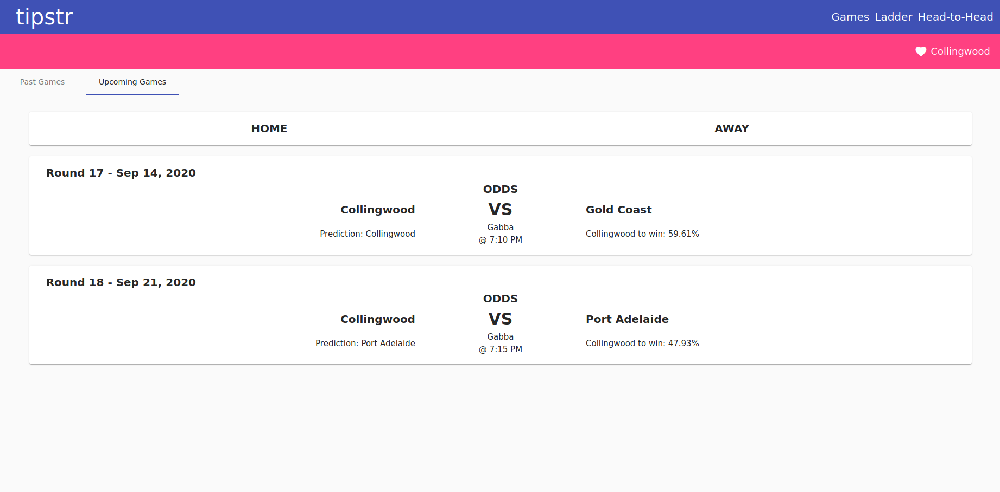

# Tipstr

## A demo Angular app using the Squiggle API `api.squiggle.com.au`

## Running the development server

This project can be run in 3 easy steps.

1) Install the Angular package: `npm install -g @angular/cli`

2) In the root project folder, run `npm istall` to reinstall all the required dependencies

3) Run `ng serve` to access the dev server. Navigate to `http://localhost:4200/`.

## Further help

*If you are having difficulties with permissions trying to install global npm packages, visit:* `https://stackoverflow.com/a/49122289`

This project was generated with [Angular CLI](https://github.com/angular/angular-cli) version 8.0.1.
To get more help on the Angular CLI use `ng help` or go check out the [Angular CLI README](https://github.com/angular/angular-cli/blob/master/README.md).
